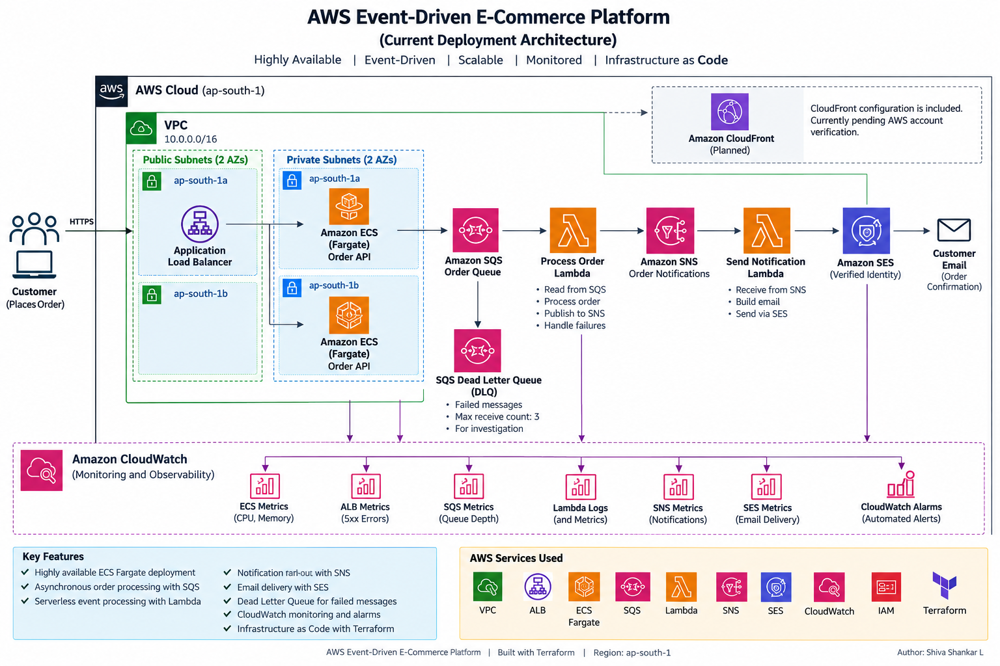

# AWS Event-Driven E-Commerce Platform

A production-style, highly available, event-driven e-commerce order processing platform built on AWS using containerized microservices, serverless event processing, managed messaging, infrastructure as code, and centralized monitoring.

The project demonstrates how an order can be accepted by a highly available API and processed asynchronously using Amazon ECS, Amazon SQS, AWS Lambda, Amazon SNS, and Amazon SES.

---

## Architecture



```text
                         Internet
                            |
                            v
                  Application Load Balancer
                            |
                            v
                 Amazon ECS / Fargate
                    |             |
                    |             |
                    v             v
                 Task 1         Task 2
                    \             /
                     \           /
                      v         v
                    Amazon SQS
                   Order Queue
                        |
                        v
               Process Order Lambda
                        |
                        v
                    Amazon SNS
                Order Notifications
                        |
                        v
              Send Notification Lambda
                        |
                        v
                    Amazon SES
                        |
                        v
                  Customer Email


             Amazon CloudWatch
          /        |        |        \
        ECS       ALB       SQS      Lambda

              SQS Dead Letter Queue
                       |
                       v
              Failed Messages
```

### CloudFront

CloudFront Terraform configuration is included in the project.

The CloudFront distribution is currently pending AWS account verification, so the active development deployment uses:

```text
Internet
   |
   v
Application Load Balancer
   |
   v
ECS Fargate
```

CloudFront can be enabled after the AWS account verification requirement is completed.

---

## Project Objective

The objective is to build an asynchronous order-processing platform where a customer places an order and the request moves through an event-driven workflow.

The platform demonstrates:

- Highly available application deployment
- Containerized application hosting
- Asynchronous order processing
- Queue-based decoupling
- Lambda-based event processing
- SNS notification fan-out
- Email notification through SES
- Dead Letter Queue handling
- ECS service auto scaling
- CloudWatch monitoring
- IAM-based access control
- Infrastructure as Code using Terraform
- Failure testing and troubleshooting

---

## Technology Stack

| Category | Technology |
|---|---|
| Cloud | AWS |
| Region | ap-south-1 |
| Application | Python / FastAPI |
| Containers | Docker |
| Container Registry | Amazon ECR |
| Container Platform | Amazon ECS / AWS Fargate |
| Load Balancing | Application Load Balancer |
| Messaging | Amazon SQS |
| Dead Letter Queue | Amazon SQS DLQ |
| Serverless Processing | AWS Lambda |
| Notification Fan-out | Amazon SNS |
| Email | Amazon SES |
| Monitoring | Amazon CloudWatch |
| Infrastructure as Code | Terraform |
| Source Control | Git / GitHub |
| Operating System | Amazon Linux 2023 |

---

## End-to-End Order Flow

The application processes an order using the following workflow:

```text
1. Customer sends POST /orders
                |
                v
2. Application Load Balancer
                |
                v
3. ECS Fargate Order API
                |
                v
4. Amazon SQS Order Queue
                |
                v
5. Process Order Lambda
                |
                v
6. Amazon SNS
                |
                v
7. Send Notification Lambda
                |
                v
8. Amazon SES
                |
                v
9. Customer receives email
```

The API does not directly perform the complete order-processing workflow.

Instead, it places the order event onto SQS and returns control to the client.

This provides asynchronous decoupling between the API and downstream processing components.

---

## Application API

The project uses FastAPI to expose the order API.

### Health Check

```http
GET /health
```

Example response:

```json
{
  "status": "healthy",
  "service": "order-api"
}
```

### Create Order

```http
POST /orders
```

Example request:

```json
{
  "customer_name": "Shiva",
  "customer_email": "customer@example.com",
  "product": "Laptop",
  "quantity": 1
}
```

Example response:

```json
{
  "order_id": "ORD-XXXXXXXX",
  "customer_name": "Shiva",
  "customer_email": "customer@example.com",
  "product": "Laptop",
  "quantity": 1,
  "status": "PROCESSING",
  "created_at": "2026-09-20T13:19:56"
}
```

---

## High Availability

The ECS service is configured to run multiple Fargate tasks across private subnets in multiple Availability Zones.

Current development configuration:

```text
Availability Zones:
- ap-south-1a
- ap-south-1b

ECS desired tasks:
2

Minimum tasks:
2

Maximum tasks:
4
```

Traffic is distributed by the Application Load Balancer across the ECS tasks.

This provides application-level redundancy if an individual task becomes unavailable.

---

## ECS Auto Scaling

The ECS service uses target-tracking auto scaling based on average CPU utilization.

Configuration:

```text
Minimum capacity: 2
Maximum capacity: 4
CPU target: 60%

Scale-out cooldown: 60 seconds
Scale-in cooldown: 120 seconds
```

The service can therefore increase the number of running tasks when workload increases and reduce capacity when demand decreases.

---

## Amazon SQS

Amazon SQS provides asynchronous decoupling between the order API and downstream processing.

The application sends an order event to:

```text
ecommerce-dev-order-queue
```

The queue is configured with:

```text
Visibility timeout: 60 seconds
Server-side encryption: Enabled
Dead Letter Queue: Enabled
Maximum receive count: 3
```

---

## Dead Letter Queue

Failed messages that cannot be processed successfully after repeated attempts are moved to:

```text
ecommerce-dev-order-dlq
```

The DLQ provides a location for investigating failed messages without allowing a permanently failing message to remain in the main processing flow indefinitely.

A controlled DLQ failure test was performed as part of the project.

See:

[`docs/incident-report.md`](docs/incident-report.md)

---

## AWS Lambda

The project uses two Lambda functions.

### 1. Process Order Lambda

```text
ecommerce-dev-process-order
```

Responsibilities:

- Consume messages from SQS
- Parse the order event
- Process the order event
- Publish the event to SNS
- Report failed SQS messages for retry handling

Flow:

```text
SQS
 |
 v
Process Order Lambda
 |
 v
SNS
```

---

### 2. Send Notification Lambda

```text
ecommerce-dev-send-notification
```

Responsibilities:

- Receive SNS notifications
- Parse the order event
- Build the confirmation email
- Send the email through Amazon SES

Flow:

```text
SNS
 |
 v
Send Notification Lambda
 |
 v
SES
```

---

## Amazon SNS

SNS provides the notification fan-out layer between order processing and downstream notification consumers.

Current topic:

```text
ecommerce-dev-order-notifications
```

The process-order Lambda publishes the order event to the SNS topic.

The notification Lambda subscribes to the topic.

---

## Amazon SES

Amazon SES is used to send customer order confirmation emails.

The current development environment uses a verified SES email identity.

The AWS account is currently operating in the SES sandbox, so email recipients must satisfy the applicable SES verification requirements.

---

## Monitoring

Amazon CloudWatch is used to monitor the platform.

Current alarms include:

### ECS CPU

```text
Alarm: ecommerce-ecs-cpu-high
Threshold: >80% CPU
```

### ALB 5xx Errors

```text
Alarm: ecommerce-alb-5xx
Threshold: 5 or more target 5xx errors
```

### SQS Backlog

```text
Alarm: ecommerce-sqs-backlog
Threshold: 10 or more visible messages
```

CloudWatch Logs are also used for Lambda and ECS troubleshooting.

---

## Infrastructure as Code

The AWS infrastructure is provisioned using Terraform.

The project uses reusable Terraform modules.

```text
terraform/
├── modules/
│   ├── vpc/
│   ├── ecr/
│   ├── ecs/
│   ├── alb/
│   ├── sqs/
│   ├── lambda/
│   ├── sns/
│   ├── notification_lambda/
│   ├── ses/
│   ├── cloudfront/
│   ├── iam/
│   └── cloudwatch/
│
└── environments/
    ├── dev/
    └── prod/
```

The environment layer supplies configuration to reusable modules.

The general flow is:

```text
terraform.tfvars
       |
       v
environment variables
       |
       v
Terraform modules
       |
       v
AWS resources
```

---

## Security

The project follows several AWS security practices:

- IAM roles are used instead of hard-coded AWS credentials.
- ECS tasks run in private subnets.
- The ALB is internet-facing.
- ECS security groups allow application traffic from the ALB.
- SQS permissions are scoped to the project queue.
- Lambda permissions are scoped to the resources they interact with where practical.
- Terraform state files are excluded from Git.
- Generated Terraform plan files are excluded from Git.
- Generated Lambda ZIP files are excluded from Git.
- Secrets and credentials are not stored in source control.

---

## Failure Handling

The project includes a controlled failure test for the SQS/Lambda workflow.

Test scenario:

```text
SQS
 |
 v
Process Order Lambda
 |
 X
Failure
 |
 v
Retry
 |
 X
Failure
 |
 v
Retry
 |
 X
Failure
 |
 v
DLQ
```

The test verified:

- SQS retry behavior
- Lambda failure handling
- DLQ redrive behavior
- CloudWatch log investigation
- Recovery of the Lambda
- Successful processing after recovery

Detailed documentation:

[`docs/incident-report.md`](docs/incident-report.md)

---

## Troubleshooting

Common troubleshooting scenarios are documented in:

[`docs/troubleshooting.md`](docs/troubleshooting.md)

The guide covers:

- ECS task failures
- ALB unhealthy targets
- SQS processing problems
- Lambda failures
- DLQ messages
- SNS notification problems
- SES email failures
- CloudFront account verification
- CloudWatch alarm states
- Terraform issues
- Docker startup problems
- Git generated artifacts

---

## Deployment

Detailed deployment instructions are available in:

[`docs/deployment.md`](docs/deployment.md)

The deployment process includes:

```text
Clone Repository
      |
      v
Build Docker Image
      |
      v
Push Image to ECR
      |
      v
Terraform Init
      |
      v
Terraform Plan
      |
      v
Terraform Apply
      |
      v
Test ALB
      |
      v
Create Order
      |
      v
Verify SQS
      |
      v
Verify Lambda
      |
      v
Verify SNS / SES
      |
      v
Verify CloudWatch
```

---

## Repository Structure

```text
aws-event-driven-ecommerce-platform/
│
├── app/
│   ├── main.py
│   ├── requirements.txt
│   ├── Dockerfile
│   └── .dockerignore
│
├── lambda/
│   ├── process_order/
│   │   └── lambda_function.py
│   └── send_notification/
│       └── lambda_function.py
│
├── terraform/
│   ├── modules/
│   │   ├── vpc/
│   │   ├── ecr/
│   │   ├── ecs/
│   │   ├── alb/
│   │   ├── sqs/
│   │   ├── lambda/
│   │   ├── sns/
│   │   ├── notification_lambda/
│   │   ├── ses/
│   │   ├── cloudfront/
│   │   ├── iam/
│   │   └── cloudwatch/
│   │
│   └── environments/
│       ├── dev/
│       └── prod/
│
├── docs/
│   ├── architecture/
│   ├── screenshots/
│   ├── deployment.md
│   ├── troubleshooting.md
│   └── incident-report.md
│
├── scripts/
├── .github/
├── .gitignore
├── README.md
└── LICENSE
```

---

## Key Implementation Highlights

### Containerized Application

The FastAPI application is packaged into a Docker image and stored in Amazon ECR.

### Highly Available ECS Deployment

Multiple ECS Fargate tasks run behind an Application Load Balancer across multiple Availability Zones.

### Asynchronous Processing

SQS decouples the API from downstream order processing.

### Serverless Processing

Lambda processes queue messages without requiring dedicated servers.

### Notification Fan-Out

SNS separates order processing from notification delivery.

### Email Delivery

SES sends customer order confirmation messages.

### Failure Recovery

SQS DLQ provides controlled failure isolation.

### Observability

CloudWatch provides logs, metrics, and alarms.

### Infrastructure as Code

Terraform manages the AWS infrastructure using reusable modules.

---

## Current Validation Status

The following components have been successfully validated:

```text
FastAPI application                 ✅
Docker image                        ✅
Amazon ECR                          ✅
VPC                                 ✅
Application Load Balancer           ✅
ECS Fargate                         ✅
ECS Auto Scaling                    ✅
Amazon SQS                          ✅
SQS Dead Letter Queue               ✅
Process Order Lambda                ✅
Amazon SNS                          ✅
Send Notification Lambda            ✅
Amazon SES                          ✅
CloudWatch monitoring               ✅
DLQ failure testing                 ✅
End-to-end order processing         ✅
CloudFront                          ⏳ Pending account verification
```

---

## Example End-to-End Result

A test order successfully travelled through the complete event-driven workflow:

```text
Customer
   |
   v
ALB
   |
   v
ECS Fargate
   |
   v
SQS
   |
   v
Process Order Lambda
   |
   v
SNS
   |
   v
Send Notification Lambda
   |
   v
SES
   |
   v
Customer Email
```

The SQS queue returned to zero visible messages after successful processing, and the notification Lambda successfully submitted the email through SES.

---

## Documentation

| Document | Description |
|---|---|
| [`deployment.md`](docs/deployment.md) | Deployment and validation procedure |
| [`troubleshooting.md`](docs/troubleshooting.md) | Common operational troubleshooting |
| [`incident-report.md`](docs/incident-report.md) | Controlled DLQ failure and recovery |
| `docs/architecture/` | Architecture diagrams |
| `docs/screenshots/` | AWS implementation screenshots |

---

## Project Learning Outcomes

This project provides hands-on experience with:

- AWS networking
- ECS/Fargate
- Application Load Balancer
- Amazon ECR
- SQS
- Dead Letter Queues
- Lambda
- SNS
- SES
- CloudWatch
- IAM
- Terraform
- Docker
- Event-driven architecture
- Asynchronous processing
- Failure handling
- Production-style troubleshooting

---

## Author

**Shiva Shankar L**

Cloud & Infrastructure / DevOps Engineer

GitHub:

https://github.com/shankar0797

